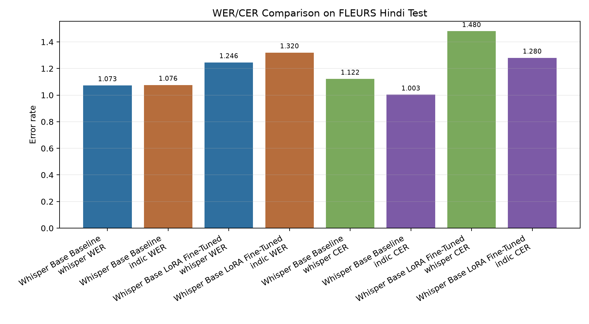
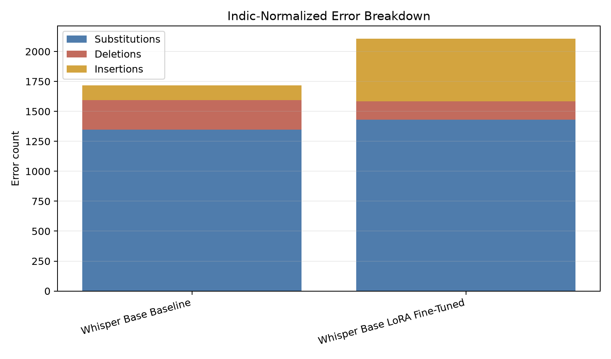
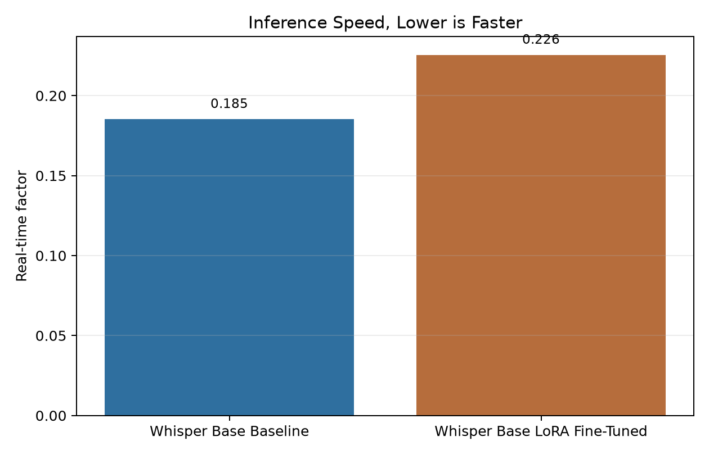

# Hindi ASR Evaluation Report

## Executive Summary

This report summarizes the completed Hindi ASR evaluation on the FLEURS Hindi test subset. The best-performing system in this run is the pretrained Whisper Base baseline.

Fine-tuning with LoRA on the available FLEURS Hindi training subset did not improve recognition accuracy. Under Indic normalization, WER increased from 1.0764 to 1.3202, and CER increased from 1.0030 to 1.2805. The recommended model from this experiment is therefore the pretrained Whisper Base baseline.

## Experiment Setup

| Item | Value |
|---|---:|
| Dataset evaluated | FLEURS Hindi |
| Evaluation split | test |
| Evaluation samples | 64 |
| Audio evaluated | 12.46 minutes |
| Hardware | NVIDIA GeForce GTX 1650, 4 GB VRAM |
| Baseline model | openai/whisper-base |
| Fine-tuning method | LoRA |
| Fine-tuning samples | 510 |
| Dev samples | 128 |
| Epochs | 1 |
| Precision | fp16 |

## Main Results

| System | Normalization | WER | CER | RTF |
|---|---|---:|---:|---:|
| Whisper Base Baseline | Whisper-style | 1.0729 | 1.1221 | 0.185 |
| Whisper Base LoRA Fine-Tuned | Whisper-style | 1.2460 | 1.4802 | 0.226 |
| Whisper Base Baseline | Indic | 1.0764 | 1.0030 | 0.185 |
| Whisper Base LoRA Fine-Tuned | Indic | 1.3202 | 1.2805 | 0.226 |

## Change After Fine-Tuning

| Metric | Whisper-style delta | Indic delta |
|---|---:|---:|
| WER | +16.1% | +22.6% |
| CER | +31.9% | +27.7% |

Positive deltas mean higher error, so the fine-tuned model is worse in this run.

## Visualizations

### WER/CER Comparison

### Indic-Normalized Error Breakdown

### Inference Speed

## Error Breakdown, Indic Normalization

| System | Substitutions | Deletions | Insertions | Reference words |
|---|---:|---:|---:|---:|
| Whisper Base Baseline | 1349 | 244 | 125 | 1596 |
| Whisper Base LoRA Fine-Tuned | 1431 | 154 | 522 | 1596 |

The fine-tuned model produced many more insertions, which is the main reason its WER increased.

## Recommendation

Use the pretrained Whisper Base baseline for the current Hindi ASR prototype. Do not use the LoRA fine-tuned checkpoint from this run for deployment because it degraded both WER and CER on the completed FLEURS Hindi evaluation.

Next experiment: train with more in-domain Hindi/Hinglish data and use a larger validation set before selecting a checkpoint.
